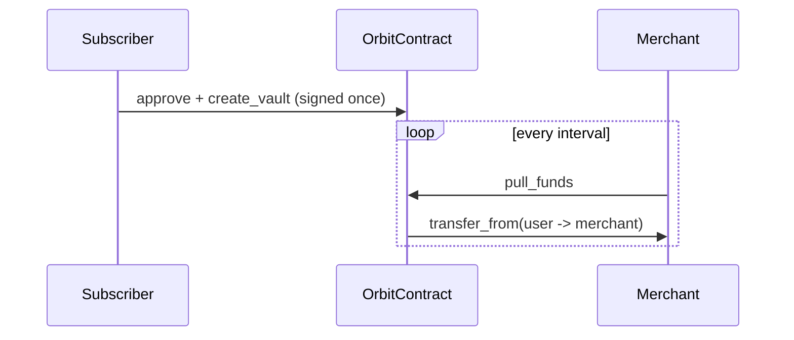

# Orbit

> Non-custodial pull payments and atomic batch payroll on Stellar Soroban.

---

## Overview

Orbit makes recurring stablecoin billing work without custody. A subscriber signs once, sets a spending ceiling on the token (SAC allowance), and keeps their funds. The merchant can pull a fixed amount only after each billing interval has passed on the ledger.

## Contract Functions

| Function | Auth | Description |
|---|---|---|
| `create_vault(user, merchant, token, amount_per_interval, interval_seconds)` | user | Records billing terms. Moves no funds. |
| `pull_funds(user, merchant)` | merchant | Pulls one cycle if `now >= last_pull + interval`. |
| `batch_disburse(sender, token, splits)` | sender | Pays many recipients in one atomic transaction. |

## Deployment

| Parameter | Value |
| :--- | :--- |
| **Orbit Contract ID** | [`CAZBZBUWBSQYK2RZ6WHMXVDLIQHSU5WD7ANZYL6HLNSCRUOTNYCDYQNG`](https://stellar.expert/explorer/testnet/contract/CAZBZBUWBSQYK2RZ6WHMXVDLIQHSU5WD7ANZYL6HLNSCRUOTNYCDYQNG) |
| **Network** | Stellar Testnet |
| **Settlement Asset** | USDC via SAC |

## Repositories

| Repo | Contents |
|---|---|
| [**Orbit**](https://github.com/Orbit-xyz/Orbit) | Soroban contract, Merchant Control Center, Merchant API, Checkout Widget SDK |
| [**orbit-docs**](https://github.com/Orbit-xyz/orbit-docs) | Developer documentation guides, contract reference, API reference |

## Links

- **Live App**: [orbit-lemon-mu.vercel.app](https://orbit-lemon-mu.vercel.app/)
- **Docs**: [orbit-docs-eta.vercel.app](https://orbit-docs-eta.vercel.app)

---

MIT. Orbit Contributors.
